# Analytical Data Architecture Audit & Relational Schema Mapping

This document provides a comprehensive audit of all data fields touched across the NGO Compliance Verification System, followed by a proposed relational schema to replace the transient/JSON-based configuration with structured, strongly-typed PostgreSQL tables.

---

## Step 1: Meticulous Data Audit

Below is the list of every data field parsed, matched, or persisted in the system.

### 1. Submission Metadata (Form Inputs & Darpan Registry)

| Field Name | Format | Origin / Source | Destination (JSON Output) | Description |
| :--- | :--- | :--- | :--- | :--- |
| `id` | String (UUIDv4) | Backend Generator | `submission.id` | Unique identifier for the submission. |
| `org_name` | String | User Form Input | `submission.org_name` | Canonical name of the NGO. |
| `state` | String | User Card Selection | `submission.state` | State code (e.g. `'mh'`, `'dl'`, `'ka'`, `'rj'`). |
| `entity_type` | String | User Dropdown Selection | `submission.entity_type` | `'Public Trust'`, `'Society'`, or `'Section 8 Company'`. |
| `pan` | String | User Form Input | `submission.pan` | 10-character alphanumeric Permanent Account Number. |
| `sector` | String | User Form Input | `submission.sector` | Primary field of NGO activity (e.g. `'Education'`). |
| `contact_email` | String | User Form Input | `submission.contact_email` | Target communication address. |
| `year_of_incorporation` | Integer | User Form Input | `submission.year_of_incorporation` | Calendar year the organization was registered. |
| `darpan_id` | String (Nullable) | User Form Input / Lookup | `submission.darpan_id` | Unique ID issued by NGO Darpan portal. |
| `status` | String | System Pipeline | `submission.status` | `'pending'`, `'processing'`, or `'complete'`. |
| `created_at` | String (ISO 8601) | System Clock | `submission.created_at` | Record creation timestamp. |
| `updated_at` | String (ISO 8601) | System Clock | `submission.updated_at` | Last modification timestamp. |

### 2. Uploaded Document Metadata

| Field Name | Format | Origin / Source | Destination (JSON Output) | Description |
| :--- | :--- | :--- | :--- | :--- |
| `id` | String (UUIDv4) | Backend Generator | `document.id` | Unique identifier for the file entry. |
| `submission_id` | String (UUIDv4) | Context Reference | `document.submission_id` | FK mapping to target submission. |
| `doc_type` | String | Upload Slot Matcher | `document.doc_type` | E.g. `'trust_deed'`, `'pan_card'`, `'annual_report'`. |
| `file_path` | String | System Storage | `document.file_path` | Local filesystem address of uploaded PDF. |
| `file_size` | Integer | OS File Descriptor | `document.file_size` | Size of file in bytes. |
| `ocr_status` | String | System Pipeline | `document.ocr_status` | `'pending'`, `'success'`, or `'failed'`. |
| `ocr_method` | String | OCR Engine Routing | `document.ocr_method` | `'pymupdf'` (digital) or `'tesseract'` (scanned). |
| `ocr_quality` | String | Analysis Metric | `document.ocr_quality` | Resolution/clarity assessment (e.g. `'high'`). |
| `uploaded_at` | String (ISO 8601) | System Clock | `document.uploaded_at` | File upload timestamp. |

### 3. Extracted Document Fields (Strict Normalized Relations)

Instead of merging all document extractions into a single unstructured `merged_fields` JSON column, fields are categorized by their originating document types.

#### Document A: Trust Deed / MOA (`extracted_trust_deeds`)
* **`org_name`** (String | Regex): The name of the organization in the deed text.
* **`reg_date`** (Date | Regex): The date the trust deed was executed.
* **`non_profit_clause`** (String | Regex): Snippet containing non-profit text declarations.
* **`objectives_clause`** (String | Regex): Extract of objectives, purposes, or targets.
* **`quorum`** (String | Regex): Dynamic quorum definition.
* **`amendment_clause`** (String | Regex): Text defining alteration rules.
* **`trustee_names`** (Array of Strings | spaCy NER): Extracted names of founding board members.
* **`org_address`** (String | spaCy NER): Extracted address.
* **`office_bearers`** (Array of Strings | spaCy NER): Office bearer listings.
* **`non_profit_clause_present`** (Boolean | Rule-based): Verified status of the non-profit clause.
* **`dissolution_clause_present`** (Boolean | Rule-based): Verified status of the dissolution clause.

#### Document B: Registration Certificate (`extracted_registration_certificates`)
* **`registration_number`** (String | Regex): Registration number issued by state registrar.
* **`registering_authority`** (String | Regex): E.g., Charity Commissioner, Registrar of Societies.
* **`date_of_registration`** (Date | Regex): Official date of registration.
* **`act_registered_under`** (String | Regex): The specific governing Act.
* **`state_of_registration`** (String | Regex): State of registration.

#### Document C: 12A Exemption Certificate (`extracted_12a_certificates`)
* **`cert_12a_number`** (String | Regex): Exemption number issued by IT Department.
* **`pan`** (String | Regex): PAN card reference.
* **`valid_from`** (Date | Regex): Validity start date.
* **`valid_until`** (Date | Regex): Expiry date.
* **`form_ref`** (String | Regex): `'10A'` or `'10AB'`.
* **`provisional_flag`** (String | Regex): `'provisional'`, `'final'`, or `'permanent'`.

#### Document D: 80G Exemption Certificate (`extracted_80g_certificates`)
* **`cert_80g_number`** (String | Regex): Exemption number.
* **`pan`** (String | Regex): PAN card reference.
* **`valid_until`** (Date | Regex): Expiry date.
* **`deduction_rate`** (Integer | Regex): Rate of exemption (e.g. `50` for 50%).

#### Document E: FCRA Certificate (`extracted_fcra_certificates`)
* **`fcra_reg_number`** (String | Regex): 9-digit registration number.
* **`valid_until`** (Date | Regex): Expiry date.
* **`bank_account`** (String | Regex): Foreign donation designated account.
* **`bank_name`** (String | Regex): Registered bank name.
* **`bank_branch`** (String | Regex): Bank branch name.
* **`sbi_designated_account`** (Boolean | Rule-based): Verified State Bank of India New Delhi Main Branch marker.

#### Document F: Annual Report (`extracted_annual_reports`)
* **`financial_year`** (String | Regex): Financial period (e.g. `'2024-25'`).
* **`total_receipts`** (Numeric | Regex): Total revenue.
* **`total_expenditure`** (Numeric | Regex): Total expenditure.
* **`grant_sources`** (Array of Strings | spaCy NER): Identified institutional grantors.
* **`csr_grant_present`** (Boolean | Rule-based): Identified CSR funding.
* **`govt_grant_present`** (Boolean | Rule-based): Identified Government funding.
* **`fund_utilisation_present`** (Boolean | Rule-based): Identified utilisation statement.

#### Document G: Audit Report (`extracted_audit_reports`)
* **`auditor_name`** (String | Regex): CA/Auditor name.
* **`auditor_icai`** (String | Regex): CA Membership/ICAI registration number.
* **`audit_period`** (String | Regex): Audited period.
* **`balance_sheet`** (Numeric | Regex): Total assets.
* **`auditor_firm`** (String | spaCy NER): Audit firm name.
* **`fcra_audit_present`** (Boolean | Rule-based): Separate FCRA audit validation marker.

#### Document H: PAN Card (`extracted_pan_cards`)
* **`pan`** (String | Regex): Tax identifier number.
* **`org_name_pan`** (String | Regex): The organization name on the PAN card.

---

## Step 2: Logical Schema Mapping (No Code)

Here is a proposed, relational schema design mapping the audited data to PostgreSQL tables.

```mermaid
erDiagram
    SUBMISSIONS ||--o| EXTRACTED_TRUST_DEEDS : "has"
    SUBMISSIONS ||--o| EXTRACTED_REGISTRATION_CERTIFICATES : "has"
    SUBMISSIONS ||--o| EXTRACTED_12A_CERTIFICATES : "has"
    SUBMISSIONS ||--o| EXTRACTED_80G_CERTIFICATES : "has"
    SUBMISSIONS ||--o| EXTRACTED_FCRA_CERTIFICATES : "has"
    SUBMISSIONS ||--o| EXTRACTED_ANNUAL_REPORTS : "has"
    SUBMISSIONS ||--o| EXTRACTED_AUDIT_REPORTS : "has"
    SUBMISSIONS ||--o| EXTRACTED_PAN_CARDS : "has"
    SUBMISSIONS ||--o{ UPLOADED_DOCUMENTS : "uploads"
    SUBMISSIONS ||--o{ COMPLIANCE_FINDINGS : "evaluates"
    SUBMISSIONS ||--o| COMPLIANCE_REPORTS : "produces"
    
    UPLOADED_DOCUMENTS ||--o| EXTRACTED_TRUST_DEEDS : "extracts"
    UPLOADED_DOCUMENTS ||--o| EXTRACTED_REGISTRATION_CERTIFICATES : "extracts"
    UPLOADED_DOCUMENTS ||--o| EXTRACTED_12A_CERTIFICATES : "extracts"
    UPLOADED_DOCUMENTS ||--o| EXTRACTED_80G_CERTIFICATES : "extracts"
    UPLOADED_DOCUMENTS ||--o| EXTRACTED_FCRA_CERTIFICATES : "extracts"
    UPLOADED_DOCUMENTS ||--o| EXTRACTED_ANNUAL_REPORTS : "extracts"
    UPLOADED_DOCUMENTS ||--o| EXTRACTED_AUDIT_REPORTS : "extracts"
    UPLOADED_DOCUMENTS ||--o| EXTRACTED_PAN_CARDS : "extracts"

    COMPLIANCE_FINDINGS ||--o| HUMAN_REVIEW_QUEUE : "escalates"
```

### Table 1: `submissions`
Primary tracking table for NGO applications.
* `id` **UUID (PK)**: Unique ID.
* `darpan_id` **VARCHAR(50) (Unique, Nullable)**: Official portal Darpan ID.
* `org_name` **VARCHAR(255) (NOT NULL)**: Submitted NGO name.
* `state` **VARCHAR(10) (NOT NULL)**: Two-letter state code.
* `entity_type` **VARCHAR(50) (NOT NULL)**: NGO entity category.
* `pan` **VARCHAR(10) (NOT NULL)**: Tax PAN code.
* `sector` **VARCHAR(100) (NOT NULL)**: Operational domain.
* `contact_email` **VARCHAR(255) (NOT NULL)**: Contact email.
* `year_of_incorporation` **INT (NOT NULL)**: Incorporation year.
* `status` **VARCHAR(50) (NOT NULL)**: Current status (`pending`, `processing`, `complete`).
* `created_at` **TIMESTAMP (DEFAULT NOW())**
* `updated_at` **TIMESTAMP (DEFAULT NOW())**

### Table 2: `uploaded_documents`
Tracks the physical files uploaded for verification.
* `id` **UUID (PK)**: Unique file identifier.
* `submission_id` **UUID (FK -> submissions.id, ON DELETE CASCADE)**: Linked submission.
* `doc_type` **VARCHAR(50) (NOT NULL)**: Document category (e.g. `'trust_deed'`).
* `file_path` **VARCHAR(512) (NOT NULL)**: FS path.
* `file_size` **INT (NOT NULL)**: File size in bytes.
* `ocr_status` **VARCHAR(50) (NOT NULL)**: Processing status.
* `ocr_method` **VARCHAR(50) (NOT NULL)**: Extraction mode.
* `ocr_quality` **VARCHAR(50) (NOT NULL)**: Clarity metrics.
* `raw_ocr_text` **TEXT (Nullable)**: Raw extracted text of document.
* `uploaded_at` **TIMESTAMP (DEFAULT NOW())**

---

### Extracted Field Tables (Normalized document data)

Each table has a `submission_id` and a `document_id` to establish origin and relation.

#### Table 3: `extracted_trust_deeds`
* `id` **UUID (PK)**
* `submission_id` **UUID (FK -> submissions.id, ON DELETE CASCADE)**
* `document_id` **UUID (FK -> uploaded_documents.id, ON DELETE CASCADE)**
* `org_name` **VARCHAR(255) (Nullable)**
* `reg_date` **DATE (Nullable)**
* `non_profit_clause` **TEXT (Nullable)**
* `objectives_clause` **TEXT (Nullable)**
* `quorum` **VARCHAR(255) (Nullable)**
* `amendment_clause` **TEXT (Nullable)**
* `trustee_names` **VARCHAR(255)[] (Nullable)**: Relational array of trustee names.
* `org_address` **TEXT (Nullable)**
* `office_bearers` **VARCHAR(255)[] (Nullable)**
* `non_profit_clause_present` **BOOLEAN (DEFAULT FALSE)**
* `dissolution_clause_present` **BOOLEAN (DEFAULT FALSE)**
* `created_at` **TIMESTAMP (DEFAULT NOW())**

#### Table 4: `extracted_registration_certificates`
* `id` **UUID (PK)**
* `submission_id` **UUID (FK -> submissions.id, ON DELETE CASCADE)**
* `document_id` **UUID (FK -> uploaded_documents.id, ON DELETE CASCADE)**
* `registration_number` **VARCHAR(100) (Nullable)**
* `registering_authority` **VARCHAR(255) (Nullable)**
* `date_of_registration` **DATE (Nullable)**
* `act_registered_under` **VARCHAR(255) (Nullable)**
* `state_of_registration` **VARCHAR(100) (Nullable)**
* `created_at` **TIMESTAMP (DEFAULT NOW())**

#### Table 5: `extracted_12a_certificates`
* `id` **UUID (PK)**
* `submission_id` **UUID (FK -> submissions.id, ON DELETE CASCADE)**
* `document_id` **UUID (FK -> uploaded_documents.id, ON DELETE CASCADE)**
* `cert_12a_number` **VARCHAR(100) (Nullable)**
* `pan` **VARCHAR(10) (Nullable)**
* `valid_from` **DATE (Nullable)**
* `valid_until` **DATE (Nullable)**
* `form_ref` **VARCHAR(10) (Nullable)**
* `provisional_flag` **VARCHAR(20) (Nullable)**
* `created_at` **TIMESTAMP (DEFAULT NOW())**

#### Table 6: `extracted_80g_certificates`
* `id` **UUID (PK)**
* `submission_id` **UUID (FK -> submissions.id, ON DELETE CASCADE)**
* `document_id` **UUID (FK -> uploaded_documents.id, ON DELETE CASCADE)**
* `cert_80g_number` **VARCHAR(100) (Nullable)**
* `pan` **VARCHAR(10) (Nullable)**
* `valid_until` **DATE (Nullable)**
* `deduction_rate` **INT (Nullable)**
* `created_at` **TIMESTAMP (DEFAULT NOW())**

#### Table 7: `extracted_fcra_certificates`
* `id` **UUID (PK)**
* `submission_id` **UUID (FK -> submissions.id, ON DELETE CASCADE)**
* `document_id` **UUID (FK -> uploaded_documents.id, ON DELETE CASCADE)**
* `fcra_reg_number` **VARCHAR(20) (Nullable)**
* `valid_until` **DATE (Nullable)**
* `bank_account` **VARCHAR(30) (Nullable)**
* `bank_name` **VARCHAR(255) (Nullable)**
* `bank_branch` **VARCHAR(255) (Nullable)**
* `sbi_designated_account` **BOOLEAN (DEFAULT FALSE)**
* `created_at` **TIMESTAMP (DEFAULT NOW())**

#### Table 8: `extracted_annual_reports`
* `id` **UUID (PK)**
* `submission_id` **UUID (FK -> submissions.id, ON DELETE CASCADE)**
* `document_id` **UUID (FK -> uploaded_documents.id, ON DELETE CASCADE)**
* `financial_year` **VARCHAR(20) (Nullable)**
* `total_receipts` **NUMERIC(15, 2) (Nullable)**
* `total_expenditure` **NUMERIC(15, 2) (Nullable)**
* `grant_sources` **VARCHAR(255)[] (Nullable)**
* `csr_grant_present` **BOOLEAN (DEFAULT FALSE)**
* `govt_grant_present` **BOOLEAN (DEFAULT FALSE)**
* `fund_utilisation_present` **BOOLEAN (DEFAULT FALSE)**
* `created_at` **TIMESTAMP (DEFAULT NOW())**

#### Table 9: `extracted_audit_reports`
* `id` **UUID (PK)**
* `submission_id` **UUID (FK -> submissions.id, ON DELETE CASCADE)**
* `document_id` **UUID (FK -> uploaded_documents.id, ON DELETE CASCADE)**
* `auditor_name` **VARCHAR(255) (Nullable)**
* `auditor_icai` **VARCHAR(50) (Nullable)**
* `audit_period` **VARCHAR(100) (Nullable)**
* `balance_sheet` **NUMERIC(15, 2) (Nullable)**
* `auditor_firm` **VARCHAR(255) (Nullable)**
* `fcra_audit_present` **BOOLEAN (DEFAULT FALSE)**
* `created_at` **TIMESTAMP (DEFAULT NOW())**

#### Table 10: `extracted_pan_cards`
* `id` **UUID (PK)**
* `submission_id` **UUID (FK -> submissions.id, ON DELETE CASCADE)**
* `document_id` **UUID (FK -> uploaded_documents.id, ON DELETE CASCADE)**
* `pan` **VARCHAR(10) (Nullable)**
* `org_name_pan` **VARCHAR(255) (Nullable)**
* `created_at` **TIMESTAMP (DEFAULT NOW())**

---

### Pipeline Results & Review Tables

#### Table 11: `compliance_findings`
Details of RAG/LLM assessments per dimension.
* `id` **UUID (PK)**: Unique ID.
* `submission_id` **UUID (FK -> submissions.id, ON DELETE CASCADE)**
* `dimension_id` **VARCHAR(50) (NOT NULL)**: Compliance dimension key.
* `status` **VARCHAR(20) (NOT NULL)**: Verdict (`PASS`, `FAIL`, `UNCERTAIN`, `CORPUS_GAP`).
* `confidence` **NUMERIC(4, 3) (NOT NULL)**: Score between 0.000 and 1.000.
* `matched_requirement` **VARCHAR(255) (Nullable)**: Legal rule identified.
* `legal_citation` **TEXT (Nullable)**: Verified act / section quote.
* `ngo_evidence` **TEXT (Nullable)**: Evidence used.
* `reasoning` **TEXT (Nullable)**: Analysis summary.
* `routing` **VARCHAR(50) (NOT NULL)**: Routing state (`auto_report`, `human_review`, `corpus_alert`).
* `citation_valid` **BOOLEAN (DEFAULT FALSE)**: Citation check flag.
* `raw_llm_output` **TEXT (Nullable)**: Raw response payload.
* `created_at` **TIMESTAMP (DEFAULT NOW())**

#### Table 12: `human_review_queue`
Active workload queue for verifying officers.
* `id` **UUID (PK)**
* `finding_id` **UUID (FK -> compliance_findings.id, ON DELETE CASCADE)**: Linked target finding.
* `submission_id` **UUID (FK -> submissions.id, ON DELETE CASCADE)**
* `assigned_officer` **VARCHAR(100) (NOT NULL)**: E.g., Officer Ramesh K.
* `queue_status` **VARCHAR(50) (NOT NULL)**: `'pending'`, `'reviewed'`.
* `ai_recommendation_revealed` **BOOLEAN (DEFAULT FALSE)**: Blind review protection state.
* `officer_determination` **VARCHAR(20) (Nullable)**: `'PASS'`, `'FAIL'`.
* `officer_notes` **TEXT (Nullable)**
* `reviewed_at` **TIMESTAMP (Nullable)**
* `created_at` **TIMESTAMP (DEFAULT NOW())**

#### Table 13: `compliance_reports`
The final generated overall compliance report details.
* `id` **UUID (PK)**
* `submission_id` **UUID (FK -> submissions.id, ON DELETE CASCADE)**
* `overall_score` **INT (NOT NULL)**
* `score_label` **VARCHAR(100) (NOT NULL)**: Label (e.g. `'Compliant — Grant Ready'`).
* `grant_ready` **BOOLEAN (NOT NULL)**
* `pass_count` **INT (NOT NULL)**
* `fail_count` **INT (NOT NULL)**
* `uncertain_count` **INT (NOT NULL)**
* `corpus_gap_count` **INT (NOT NULL)**
* `report_path` **VARCHAR(512) (NOT NULL)**: PDF destination path.
* `generated_at` **TIMESTAMP (DEFAULT NOW())**
